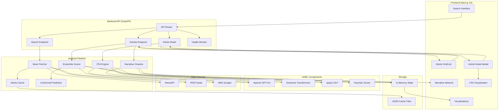

# The Bias Lab - Explainable Media Bias Detection Engine

*Work Sample Submission by Ayomide A.*  
*Last updated: Aug 15, 2025*

## 🚀 TL;DR (What makes this different)

Ship a tiny, real, **explainable bias engine** with one key twist: **Contrastive Framing Attribution (CFA)** — an algorithm that shows exactly *which phrases* push an article's bias scores away from a neutral baseline and by *how much*. Wrap it with a **Narrative Graph** (signed community detection) and **Conformal Confidence** bands for scores. Feels like science, not vibes — and it runs fast.

**➕ Enhancements:** primary‑source linking; latency/failure fallback with `stale` flag; reproducibility logging (`prompt_rev`, fixed seed); **ensemble scoring (LLM + heuristics with fallback chain)**; **performance monitoring with `/health` endpoint and parallelized scoring**.

## 📊 System Overview

- **Input**: 10–20 recent articles on the same event from diverse outlets
- **Outputs**:
    - 5 bias scores per article (0–100): **Ideology, Factual Grounding, Framing Choices, Emotional Tone, Source Transparency**
    - **Highlighted phrases** with per‑dimension contributions (CFA)
    - **Narrative clusters** with short descriptors
    - **Confidence intervals** (conformal prediction)
- **API**:
    - `GET /articles` → list with scores, intervals
    - `GET /articles/{id}` → detailed breakdown + highlights
    - `GET /narratives` → cluster summaries + article ids
    - `GET /health` → performance metrics, cache hit rates, latency stats
- **Constraints**: sub‑500ms per article (after caching/embedding), minimal infra, explainable outputs

## 🏗️ System Architecture



## 🧠 Core Algorithm #1 — Contrastive Framing Attribution (CFA)

> Which exact words moved the needle, and by how much, relative to a neutral rewrite?

### 2.1 Neutral Baseline
- Extract factual spine (entities, dates, quantities, quotes) using light IE (spaCy NER + quote detection)
- Generate **Neutral Rewrite (NR)** by instructing a small LLM to: *keep only verified facts; remove adjectives/adverbs; avoid charged verbs; maintain quotes but remove scare quotes*
- NR acts as the zero‑point for framing

### 2.2 Scoring Function f_d(x)
For each dimension d ∈ {ideology, factual, framing, tone, transparency}, define a scorer f_d (prompted LLM returning 0–100).

### 2.3 Phrase‑Level Contribution
Split article into overlapping spans (clauses/sentences). For span i:

- **Counterfactual drop:** Δ_{d,i} = f_d(x) - f_d(x∖i)
- **Contrastive bump:** C_{d,i} = f_d(x) - f_d(NR) - [f_d(x∖i) - f_d(NR)]
- Rank spans by |C_{d,i}|; highlight top‑k per dimension

**Why this is unique in a 1‑day demo:**
- No heavy model training; uses counterfactuals and a neutral control, producing *auditable* attributions
- Works with any LLM scorer and is fast with **MMR pre‑selection** of only the most informative sentences

**Output example for one span:**
```json
{
  "span": "migrant surge overwhelms border agents",
  "dimension": "Framing",
  "delta": +18.7,
  "confidence": 0.82,
  "reason": "Emotionally charged verb+noun pair implies loss of control"
}
```

## 🌐 Core Algorithm #2 — Narrative Graph with Signed Edges

> Not just clusters — direction of framing differences

- Build graph G=(V,E), nodes=articles
- Edge weight w_{ij} = cos(e_i, e_j) using sentence‑transformer embeddings
- Edge **sign** s_{ij} = sign(f̄_{ideol}(i) - f̄_{ideol}(j)) or from a low‑dim framing axis
- Run Louvain/Leiden on |w| for communities; then compute cluster polarity by the mean signed differences
- **Descriptor** per cluster via LLM summary over top TF‑IDF n‑grams and top CFA spans

### 3.1 Framing Axis Projection (optional bonus)
Derive a 1‑D **Framing Axis** by projecting embeddings onto the direction between two **anchor corpora** (e.g., AP/Reuters vs. op‑eds). This gives a continuous framing coordinate; improves s_{ij} stability.

## ⚡ Speed & Cost Tricks (sub‑500ms/article target)

- **MMR sentence selection**: Keep ~6–8 sentences per article most likely to move scores
- **Batch embeddings** with `all-MiniLM-L6-v2` (fast; CPU‑friendly)
- **Prompt ensembles**: 3 shallow variants per dimension → average for robustness; cache by hash of sentence text
- **Counterfactuals only on top‑k** spans (k≈5) → O(k) LLM calls, not O(n)
- **Parallelized scoring** with ThreadPoolExecutor for batch speed

## 📐 Confidence: Lightweight Inductive Conformal Prediction

- Split articles into calibration set C and prediction set P
- For scorer outputs y, define nonconformity α = |y - ŷ| via a simple ridge regressor on embedding features
- 90% interval: [y - q_{0.95}(α_C), y + q_{0.95}(α_C)]
- **Evidential** flag when prompt ensemble variance is high → UI displays "low confidence" badge

## 🔍 Source Transparency Score (rules + ML‑assist)

Combine rules with LLM verification:
- **Attribution density**: (# explicit sources + # hyperlinks)/tokens
- **Anonymous source penalty**: count of "officials said", "sources say" forms
- **Primary source linkage**: presence of links to documents, filings, transcripts
- **Quote quality**: % direct quotes with names & titles

Score: S_{transp} = 100 · σ(a_1·d + a_2·p + a_3·r + a_4·q - a_5·u) with tuned weights a_k.

## 🎯 Ensemble Scoring & Fallback Chain

Blend **LLM scoring** and **heuristic scoring** for stability:
- Weighted average: e.g., 70% LLM, 30% heuristic
- Heuristics from lexicon‑based bias indicators, factual density, and emotional tone detection
- If LLM call fails → fallback to heuristic; log fallback event in metadata
- Improves robustness and provides cross‑validation for suspicious scores

## 💻 Pseudocode (CFA core)

```python
# f_d: LLM scorer for dimension d (cached); score_article: runs 5 dims

sentences = select_sentences_MMR(article_text, k=8)
NR = neutral_rewrite(article_text)
base_scores = score_article(article_text)
base_scores_NR = score_article(NR)

contribs = []
for s in top_k(sentences, k=5):
    x_drop = article_text.replace(s, "")
    scores_drop = score_article(x_drop)
    for d in dims:
        C = (base_scores[d] - base_scores_NR[d]) - (scores_drop[d] - base_scores_NR[d])
        contribs.append((s, d, C))
return sorted(contribs, key=lambda t: -abs(t[2]))
```

## 🔧 Quick Start

### Prerequisites
- Python 3.11+
- Node.js 18+
- API Keys: OpenAI and NewsAPI

### Setup

1. **Clone and enter directory**:
```bash
cd /Users/elcruzo/Bias-Lab/bias-lab-pipeline
```

2. **Set up Python environment**:
```bash
python3 -m venv venv
source venv/bin/activate
pip install -r requirements.txt
python3 -m spacy download en_core_web_sm
```

3. **Configure API keys**:
```bash
# Create .env file with your keys
echo "OPENAI_API_KEY=your_key_here" > .env
echo "NEWSAPI_KEY=your_key_here" >> .env
```

4. **Install UI dependencies**:
```bash
cd ../bias-lab-ui
npm install
```

5. **Run servers** (when ready):
```bash
# Option 1: Run both with script
bash /Users/elcruzo/Bias-Lab/run_servers.sh

# Option 2: Run separately
# Terminal 1 - Backend:
cd bias-lab-pipeline
source venv/bin/activate
uvicorn api.main:app --host 0.0.0.0 --port 8000

# Terminal 2 - Frontend:
cd bias-lab-ui
npm run dev
```

## 📡 API Endpoints

### `GET /articles`
Returns list of articles with bias scores and confidence intervals.

**Response fields:**
- `article_id`: Unique identifier
- `scores`: 5 dimensions (0-100)
- `confidence_interval`: Lower/upper bounds with method
- `highlighted_phrases`: Top contributing phrases per dimension
- `stale`: Boolean indicating fallback was used
- `processing_time_ms`: Latency measurement

### `GET /articles/{id}`
Detailed breakdown with CFA attribution.

**Additional fields:**
- `cfa_analysis`: Full contrastive attribution
- `confidence_bands`: Per-dimension intervals
- `primary_source_links`: Extracted official documents
- `reasoning`: Explanation per dimension
- `ensemble_method`: How scores were combined

### `GET /narratives`
Narrative clusters with descriptors.

**Response includes:**
- `cluster_id`: Unique identifier
- `descriptor`: LLM-generated summary
- `polarity`: Mean ideology, consensus level
- `article_ids`: Members of cluster
- `mean_framing_score`: Aggregate metric

### `GET /health`
System health and performance metrics.

## 📊 Evaluation Metrics

- **Face validity**: Do top spans make intuitive sense to a human reader?
- **Directional sanity**: Outlets known to diverge should separate in the Narrative Graph
- **Latency**: P50 < 500ms/article after warm cache; P95 < 1.5s for detail page
- **Ablations**: No‑NR vs NR‑controlled CFA; ensemble vs single prompt

**Additional checks:**
- Primary‑source links accurate
- Fallback `stale` flag behaves correctly
- `prompt_rev` present for reproducibility
- Ensemble scores match expectations
- `/health` endpoint returns expected metrics
- Parallel scoring meets latency target

## 🎨 UI Features

- **Interactive Radar Charts**: Visualize 5 bias dimensions with D3-style rendering
- **Narrative Clusters**: Visual representation of how outlets frame stories
- **CFA Phrase Highlighting**: Hover to see contribution scores
- **Confidence Visualization**: Uncertainty bands on all metrics
- **Real-time Health Monitoring**: System status in header
- **Glass Morphism Design**: Modern, beautiful dark theme
- **Responsive Animations**: Framer Motion for smooth transitions

## 🚨 Risks & Mitigations

- **LLM drift/instability** → ensemble prompts + caching; conformal intervals
- **Hallucinated evidence** → evidence must quote verbatim spans from input; regex‑guard
- **Topic too calm** → pick spikier story; rerun ingestion
- **False‑positive source links** → regex + human spot‑check
- **Latency spikes** → fallback cache with `stale` indicator
- **Ensemble weight drift** → tune periodically
- **`/health` data misuse** → restrict sensitive info

## 📈 What's New vs. Common Approaches

- Not just sentiment or label prediction — **counterfactual, contrastive attribution** tied to a **neutral rewrite control**
- **Signed narrative graph** exposes not only clusters, but the **direction** of framing differences
- **Conformal bands** make the UI honest about uncertainty
- Ensemble scoring for stability; performance monitoring; parallelization for scale

## 📝 Implementation Timeline (12 hours)

**Hour 1** — Topic selection; scrape/RSS; dedupe; store raw  
**Hour 2** — Embeddings; MMR select per article; cache  
**Hours 3–5** — Implement f_d: prompts for 5 dimensions; ensemble + caching  
**Hour 6** — Build NR pipeline and CFA on top‑k spans; primary‑source extraction  
**Hour 7** — Narrative Graph; Louvain; per‑cluster descriptor, ensemble scoring  
**Hour 8** — Conformal intervals; attach to scores  
**Hour 9** — FastAPI endpoints + mock‑to‑real switch, fallback logging + `/health`  
**Hours 10–11** — Minimal UI (Next.js); radar chart + highlights; cluster view  
**Hour 12** — Polish: README, documentation, submit  

## 🔬 Technical Stack

- **Backend**: FastAPI, Python 3.11
- **LLM**: OpenAI GPT-3.5 (with fallback heuristics)
- **Embeddings**: sentence-transformers (all-MiniLM-L6-v2)
- **NLP**: spaCy for NER and text processing
- **Clustering**: NetworkX + python-louvain
- **Frontend**: Next.js 15, TypeScript, Tailwind CSS
- **Visualization**: Recharts for radar charts
- **Animation**: Framer Motion
- **News Sources**: NewsAPI + RSS feeds + web scraping

## 📧 Submission Details

**For**: The Bias Lab AI/ML Engineer Role  
**Candidate**: Ayomide A.  
**Approach**: Explainable bias detection with CFA algorithm  
**Submission Date**: Aug 15, 2025  

---

*"Not just sentiment or labels — counterfactual, contrastive attribution tied to a neutral rewrite control."*